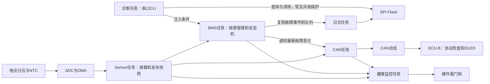

# STM32 双节点电池监测：从裸机到 FreeRTOS

一个可以通过串口主动注入故障、观察报警、查看 CAN 状态、读取掉电日志的 STM32F103 学习项目。

**主线版本：ECU-A 使用 FreeRTOS，ECU-B 保留裸机仪表循环。** ECU-A 负责采样、故障判断、状态管理、通信和记录；ECU-B 负责检查接收数据并显示。项目作者已完成当前版本整机上板回归验收。

硬件是单节电池电压与 NTC 温度监测平台。当前没有电流采样、均衡电路和充放电 MOS，因此 FAULT 只会触发软件报警、CAN 上报与日志记录，不能物理切断电流；SOC 是基于电压的简化显示估算，不是库仑计量。充放电 MOS 是计划中的后续升级，设计边界与控制链见[架构与数据流](docs/架构与数据流.md#后续升级充放电-mos)。

## 先从这里开始

| 想了解什么 | 阅读入口 |
|---|---|
| 准备器件、接线、编译、烧录 | [复现教程](docs/复现教程.md) |
| 仓库每层目录和源码文件负责什么 | [项目文件结构](docs/项目文件结构.md) |
| 每个模块为何存在，谁读谁写 | [架构与数据流](docs/架构与数据流.md) |
| 什么情况下报警，何时能够恢复 | [故障管理与注入实验](docs/故障管理与CLI.md) |
| 三种 CAN 报文、计数器、CRC、超时 | [CAN 通信](docs/CAN通信协议.md) |
| 官方 FreeRTOS 文件到底改了什么 | [内核与配置差异](docs/FreeRTOS配置说明.md) |
| 怎样回归验证，如何介绍设计选择 | [验证与面试](docs/验证与面试表达.md) |
| 裸机与 RTOS 的区别、历史来源 | [版本演进](docs/版本演进.md) |

## 整体结构



## 一个可重复的实验

串口设为 **115200、8N1**，接 ECU-A，逐条发送，末尾带真实换行：

```text
status
fault inject ov
fault
log
fault inject none
```

过压注入持续约 500 ms 后，故障确认、蜂鸣器报警、CAN 上报、Flash 留下一条带传感器快照的记录。`status` 中真实电压保持原测量值：注入只作用于判断条件。

撤销注入后，真实电压必须低于 4.10 V 并稳定 1 秒，才允许按恢复键清除。清除后产生另一条恢复记录。完整步骤和反例见[故障实验](docs/故障管理与CLI.md)。

## 版本

- `main`：当前验收版，推荐从这里编译与学习。
- `baseline/baremetal`：保存早期裸机快照，用于对照调度方式；使用该分支自己的两个 ECU 工程与说明。

两版不是仅替换调度器：主线同时完善了故障管理、协议校验、CLI、日志和健康监控。不能混用两版 ECU 固件。

## 开源范围与当前限制

自编业务代码和文档采用 [MIT](LICENSE)。FreeRTOS 保留上游 MIT；ST/CMSIS 依赖按[安装教程](docs/复现教程.md)从用户持有的官方包恢复，未包含在公开源码中，详见[第三方说明](THIRD_PARTY_NOTICES.md)。

当前串口 TX 仍同步发送，多任务输出可能交错；日志队列满会记录丢弃次数；Flash 底层部分等待缺少超时。这些是后续改进方向，不能将本项目描述为量产车规 BMS。
