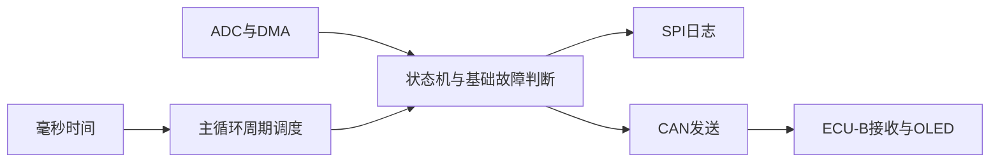

# STM32双ECU：早期裸机基线

当前分支保存历史裸机代码。推荐使用[main分支的当前验收版](https://github.com/Nway-J/stm32-bms/tree/main)，其中ECU-A已迁移为FreeRTOS，并完善了故障管理、CLI和通信诊断。

## 来源

作者旧私有仓库 stm32-bms-freertos-portfolio，baseline/baremetal提交 `baae12b7cfc09599bbbcb3eadd16f0ad4a9fd991`。公开整理仅保留业务源码及工程结构，ST依赖改为自行恢复。该版本早于正式RTOS迁移前的最后一轮裸机改造，不声称功能与main等价。

## 模块关系



模块详解见[架构](docs/architecture.md)，历史协议及已知显示问题见[协议](docs/can-protocol.md)。该版本有演示性充放电状态与电压比例/显示缺陷；当前硬件没有充放电 MOS，故障状态只能报警、上报和记录，不能物理切断电流。后续 MOS 改造的裸机控制思路见[充放电 MOS 升级路线](docs/architecture.md#后续升级充放电-mos)，不能将该规划当作已经实现的功能，也不能与main的ECU-B混烧。

## 编译

取得对应ST SPL/CMSIS软件包，使用：

```powershell
powershell -ExecutionPolicy Bypass -File tools/install-dependencies.ps1 -SourceRoot 'D:\SDK'
```

脚本按 [精确依赖清单](docs/dependencies.json) 恢复文件。该历史版本ST文件不同于main，必须匹配哈希。再用Keil ARMCC5打开 `ECU_A/ECU_A.uvprojx` 与 `ECU_B/ECU_B.uvprojx` 分别Rebuild，设置本机SWD下载器后烧录。

历史快照用于学习对照；公开前删除了逐帧调试输出、废弃注释代码并统一格式，同时修正了Flash日志回绕计数与SPI字节收发中的明确缺陷。整理后的编译结果见[构建记录](docs/build-results.txt)。项目作者已对整理后的两个节点完成上板验证。

自编代码采用[MIT](LICENSE)。ST/CMSIS依赖未包含在公开源码中，其权利仍归原作者，按供应方条款取得使用。
