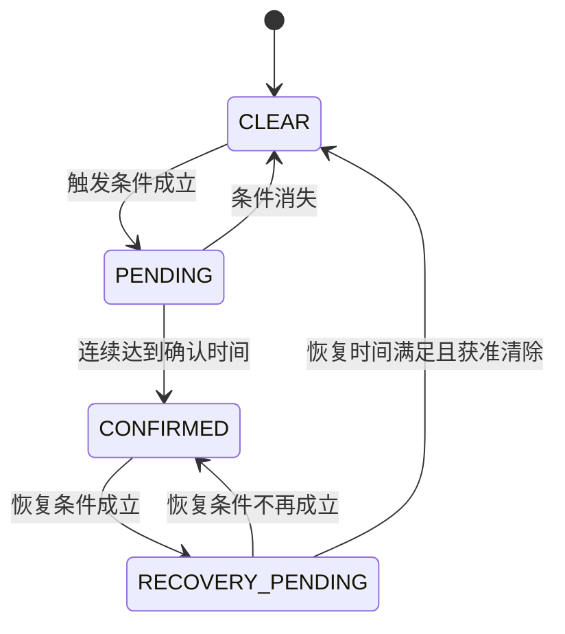

# 故障管理与CLI实验

## 故障如何成为报警



确认时间为0的故障可以直接确认。人工清除只对已恢复就绪的故障有效。恢复键不是“无条件取消报警”。过压4.20V触发、4.10V恢复之间的区间是迟滞，避免在一个阈值附近反复报警/清除。

规则源文件：[`app_fault_manager.c`](../ECU-A/App/app_fault_manager.c) 与 [`app_bms_state.c`](../ECU-A/App/app_bms_state.c)。以下阈值是本学习项目标定。

| 故障 | 触发条件 | 确认 | 恢复条件 | 恢复持续 | 清除/系统影响 |
|---|---|---:|---|---:|---|
| OV过压 | 有效电压>4.20V | 500ms | 有效电压<4.10V | 1000ms | 人工；关键故障 |
| UV欠压 | 有效电压<3.00V | 500ms | 有效电压>3.10V | 1000ms | 人工；关键故障 |
| OT过温 | 有效温度>60℃ | 500ms | 有效温度<55℃ | 1000ms | 人工；关键故障 |
| NTC开路 | NTC开路分类 | 500ms | NTC正常且温度有效 | 1000ms | 人工；关键故障 |
| NTC短路 | NTC短路分类 | 500ms | NTC正常且温度有效 | 1000ms | 人工；关键故障 |
| 数据异常 | 快照内容不满足一致性检查 | 100ms | 快照一致 | 1000ms | 人工；关键故障 |
| ADC超时 | 无数据或采样年龄≥100ms | 立即 | 新鲜快照恢复 | 1000ms | 人工；关键故障 |
| 自检失败 | 上电自检失败 | 立即 | 本次启动保持失败条件 | — | 重启重新自检 |
| CAN降级 | EWGF或EPVF，且非Bus-Off | 500ms | 控制器健康且最近发送成功 | 1000ms | 自动；警告 |
| CAN Bus-Off | 驱动Bus-Off累计次数变化 | 立即 | 控制器健康且最近发送成功 | 1000ms | 人工；关键故障 |

关键故障使状态机进入FAULT并报警，日志记录变化，CAN通知尽快发送。警告会出现在故障状态中，但不因其本身强制进入FAULT。多个故障可同时存在，恢复其中一个不代表所有故障已解除。

`Active`表示当前有效故障；`Latched`表示锁存信息；`Critical`筛选关键故障；`RecoveryReady`表示达到恢复条件但可能仍在等待人工清除。`Changed`表示这一次发生变化的位，不是故障总数。

## 命令表

串口：115200、8数据位、无校验、1停止位。每条命令以LF或CR结束；串口工具勾选转义解析时，输入 `\n` 才会变成换行字节。

| 命令 | 做什么 | 观察结果 |
|---|---|---|
| `help` | 查看支持命令 | 命令列表 |
| `status` | 测量与状态 | 电压、温度、ADC、时间、快照年龄 |
| `fault` | 故障汇总 | 活动、锁存、关键、恢复就绪、注入标志 |
| `can stats` | CAN运行统计 | 成功/失败、Bus-Off、恢复次数、ESR |
| `log` | 输出历史记录 | BOOT、CONFIRMED、CLEARED和快照 |
| `log clear` | 擦除历史日志 | 历史不可恢复，下一索引归零 |
| `fault inject <name>` | 替换当前注入条件 | 见下表 |
| `fault inject none` | 撤销注入 | 不立即清除已确认故障 |
| `watchdog test` | 停止喂狗 | 约4秒复位，BOOT记录看门狗原因 |
| `reboot` | 软件复位 | 重启并记录复位原因 |

## 注入点在哪里

```text
CLI收到名称 → 设置注入掩码 → 故障管理器强制对应触发条件
                            ↓
                  正常确认时间、锁存和恢复逻辑
                            ↓
                   BMS报警 / CAN / Flash
```

注入发生在故障判断层，不修改ADC寄存器、DMA数据或传感器物理量。它验证判断之后的链路，不能证明ADC断线检测或实际过温硬件路径正确。

| name | 模拟条件 | 等待多久确认 | 特别说明 |
|---|---|---:|---|
| `ov` | 过压 | 500ms | status仍显示真实电压 |
| `uv` | 欠压 | 500ms | 与真实低压测试互补 |
| `ot` | 过温 | 500ms | 无需实际加热到60℃ |
| `ntc_open` | NTC开路 | 500ms | 不会真正拔断NTC |
| `ntc_short` | NTC短路 | 500ms | 不会真正短接输入 |
| `sensor_data` | 数据异常 | 100ms | 验证异常处理链路 |
| `adc_timeout` | 采样超时条件 | 立即 | ADC可继续采集，因此不保证触发缺少采样心跳复位 |
| `none` | 停止注入 | — | 回到真实输入决定恢复条件 |

每条注入命令替换掩码，不叠加。之前已锁存的故障仍可能存在；CLI不支持任意十六进制掩码或CAN故障注入。重启撤销注入。

## 完整过压实验

1. 两节点运行，真实电压保持约3.9V、温度正常；按启动键进入监测。
2. `status`记录初值，再发 `fault inject ov`。
3. 等待1秒，发 `fault`：过压已确认、关键故障存在，蜂鸣器/OLED显示相应故障。
4. 发 `status`：真实电压仍约3.9V；发 `log`：新增CONFIRMED、Source=INJECTED。
5. 保持注入时按恢复键：不应清除。
6. 发 `fault inject none`，等超过1秒，发 `fault`：RecoveryReady出现过压位。
7. 按恢复键：故障清除，系统回到待机；重新按启动键进入监测。
8. 发 `log`：新增CLEARED、Source=RECOVERY。重启后再读，记录应仍存在。

反例：真实电压若仍为4.3V，撤销注入也不能恢复。处在4.15V迟滞区也不满足低于4.10V的恢复条件。

## 日志意味着什么

每条32字节，当前一个4KB扇区容纳128条。记录保存事件时刻、变化/活动故障、传感器数值及有效标志、BMS状态、CAN状态和复位原因，并进行校验。扫描会跳过已占用但无效的位置；满扇区后的擦除意味着它不是无限历史存储。

BOOT时采样尚未完成，Voltage/Temperature=INVALID是正常现象。INVALID槽表示记录未通过校验，不能将它解释为一个有效故障事件。
