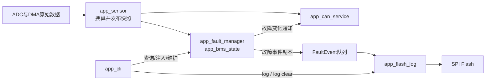

# 项目文件结构

这份文档回答两个问题：打开仓库后先看哪里，以及每一层代码负责什么。

本项目采用双控制器结构。`ECU-A` 是主控制器，负责采样、故障判断、状态管理、CAN 发送、Flash 日志和串口诊断；`ECU-B` 是显示端，负责接收并校验 CAN 数据，再更新 OLED。业务逻辑放在 `App`，直接操作芯片外设的代码放在 `Bsp`，FreeRTOS 内核与芯片官方库分别独立存放，避免所有代码堆在一个目录里。

## 仓库顶层

```text
stm32-bms/
├─ ECU-A/                    主控制器工程（FreeRTOS，项目重点）
│  ├─ App/                   BMS应用与业务逻辑
│  ├─ Bsp/                   STM32板级外设驱动
│  ├─ FreeRtos/              FreeRTOS内核、移植层和工程配置
│  ├─ User/                  ECU-A启动入口
│  └─ Project.uvprojx        ECU-A的Keil工程文件
├─ ECU-B/                    仪表/显示控制器工程（裸机）
│  ├─ App/                   CAN数据处理与显示业务
│  ├─ Bsp/                   CAN、OLED、I2C、串口等驱动
│  ├─ FreeRtos/              保留的内核文件，当前业务未启用RTOS调度
│  ├─ User/                  ECU-B启动入口和裸机主循环
│  └─ Project.uvprojx        ECU-B的Keil工程文件
├─ docs/                     架构、协议、故障、复现和验证文档
├─ tools/                    第三方依赖恢复脚本
├─ README.md                 项目首页和阅读导航
├─ LICENSE                   自编代码的MIT许可证
└─ THIRD_PARTY_NOTICES.md    ST、CMSIS、FreeRTOS等第三方说明
```

如果只想快速理解项目，建议按这个顺序阅读：

1. `README.md`：先了解项目能做什么和当前硬件边界。
2. `ECU-A/User/main.c`：查看系统按照什么顺序启动。
3. `ECU-A/App/app_rtos.c`：查看六个任务怎样分工和协作。
4. `ECU-A/App/app_sensor.c` → `app_fault_manager.c` → `app_bms_state.c`：沿着核心数据流阅读。
5. `app_can_service.c`、`app_fault_event.c`、`app_flash_log.c`：了解通信和故障留痕。
6. `app_cli.c`：查看诊断命令怎样读取这些模块的状态。

## ECU-A：主控制器

### User：系统入口

```text
ECU-A/User/
└─ main.c
```

`main.c` 只负责系统启动和模块装配：设置中断优先级，依次初始化 GPIO、USART、ADC、SPI Flash、CAN、故障管理和健康监控，创建 FreeRTOS 任务，最后启动调度器。正常业务不写在 `main()` 的死循环里。

### App：应用层

```text
ECU-A/App/
├─ app_rtos.c / .h           创建任务，定义周期、优先级和任务间协作
├─ app_sensor.c / .h         读取ADC结果，换算电压/温度，发布传感器快照
├─ app_fault_manager.c / .h  故障确认、迟滞、恢复、锁存和人工清除
├─ app_bms_state.c / .h      BMS状态机、按键行为、蜂鸣器和LED业务动作
├─ app_event.c / .h          BMS内部状态事件队列
├─ app_fault_event.c / .h    保存故障确认/清除瞬间的事件副本
├─ app_flash_log.c / .h      Flash日志扫描、写入、校验、读取和清空
├─ app_can_service.c / .h    生成周期CAN状态报文和紧急故障报文
├─ app_cli.c / .h            USART诊断命令解析与结果输出
├─ app_health_monitor.c / .h 检查关键任务心跳并决定是否喂看门狗
└─ app_scheduler.c / .h      旧裸机调度器，保留作迁移过程对照，主线不再调用
```

这一层不应该直接展开复杂的寄存器配置。它关心的是“电压是否过高”“故障是否可以恢复”“应该发什么状态”等业务问题。

核心数据路径如下：



六个 FreeRTOS 任务都在 `app_rtos.c` 创建：

| 任务 | 主要职责 | 运行方式 |
|---|---|---|
| HealthTask | 检查 Sensor、BMS、CAN 是否按窗口完成工作 | 每 100 ms |
| SensorTask | 消费 ADC/DMA 新数据并发布最新测量快照 | 每 1 ms 检查 |
| BmsTask | 运行故障管理、状态机、按键和报警逻辑 | 每 10 ms |
| CanTask | 发送电压、温度、故障报文，响应故障变化通知 | 周期＋任务通知 |
| FaultLogTask | 从队列取故障事件并写入外部 Flash | 队列为空时阻塞 |
| DiagnosticTask | 解析 CLI，更新任务栈和 Heap 诊断值 | 每 1 ms 检查 |

### Bsp：板级驱动层

```text
ECU-A/Bsp/
├─ bsp_adc_dma.c / .h        ADC双通道采样和DMA数据搬运
├─ bsp_tim.c / .h            TIM3定时与ADC硬件触发
├─ bsp_can.c / .h            CAN初始化、发送、接收和错误恢复
├─ can_protocol.h             ECU-A、ECU-B共用的报文格式、Alive和CRC规则
├─ bsp_spi_flash.c / .h      SPI1与XM25QH32读、写、擦除操作
├─ bsp_usart.c / .h          USART1收发、中断接收和环形缓冲区
├─ bsp_gpio.c / .h           LED、启动键和恢复键
└─ bsp_buzzer.c / .h         蜂鸣器初始化与开关
```

这一层回答“怎样操作硬件”。例如，`app_sensor.c` 只要求取得两路 ADC 数据，不需要知道 DMA 通道和寄存器怎样配置；`app_flash_log.c` 只组织日志记录，不负责 SPI 每个字节怎样收发。

### FreeRtos：内核与移植

```text
ECU-A/FreeRtos/
├─ FreeRTOSConfig.h          本项目的内核功能、节拍、优先级和内存配置
├─ freertos_hooks.c          栈溢出、内存分配失败等Hook
├─ inc/                      FreeRTOS公共头文件
├─ src/                      tasks、queue、list等内核源码
├─ port/port.c               Cortex-M3端口实现
├─ port/portmacro.h          Cortex-M3端口宏和基础类型
└─ port/heap_4.c             当前工程使用的动态内存分配方案
```

业务任务不放进 FreeRTOS 目录。这里保存通用内核及其工程配置，项目自己的任务仍放在 `App/app_rtos.c`。本项目对官方配置的具体调整见[FreeRTOS配置说明](FreeRTOS配置说明.md)。

## ECU-B：显示控制器

```text
ECU-B/
├─ User/main.c               裸机初始化、CAN接收和OLED刷新循环
├─ App/
│  └─ app_dash.c / .h        解析状态、检查Alive/CRC/超时、准备显示数据
├─ Bsp/
│  ├─ bsp_can.c / .h         CAN收发驱动
│  ├─ can_protocol.h         与ECU-A一致的CAN协议
│  ├─ bsp_oled.c / .h        OLED显示接口
│  ├─ bsp_i2c.c / .h         OLED使用的软件I2C
│  ├─ bsp_gpio.c / .h        LED和GPIO
│  ├─ bsp_tim.c / .h         裸机时间基准
│  └─ bsp_usart.c / .h       串口调试输出
└─ Project.uvprojx           Keil工程配置
```

ECU-B 不参与电压采样和故障判定。它只相信通过协议校验且没有超时的报文，所以显示端的数据异常不会反向改变 ECU-A 的保护状态。

## 本地完整工程还会出现的目录

GitHub 仓库没有直接提交部分 ST/CMSIS 官方文件。按照[复现教程](复现教程.md)运行依赖安装脚本后，ECU-A 和 ECU-B 下还会出现：

```text
Start/                       CMSIS内核头文件、系统时钟和启动汇编
Library/                     STM32F10x标准外设库源码与头文件
DebugConfig/                 Keil调试器目标配置
Objects/                     编译产生的目标文件、AXF、HEX等
Listings/                    编译器和链接器清单
```

其中 `Start` 和 `Library` 是第三方依赖；`Objects`、`Listings` 是编译产物，删除后重新编译即可生成。阅读业务架构时通常不需要从这些目录开始。

## 怎样判断一个新文件应该放在哪里

| 新增内容 | 应放位置 | 例子 |
|---|---|---|
| 故障策略、状态判断、数据组织 | `App/` | 增加充放电许可策略 |
| GPIO、ADC、SPI、CAN等芯片操作 | `Bsp/` | 增加电流传感器ADC驱动 |
| 系统初始化和模块装配 | `User/main.c` | 初始化新外设与服务 |
| FreeRTOS内核开关或移植代码 | `FreeRtos/` | 修改任务通知相关配置 |
| 两个ECU必须共同遵守的通信格式 | 两端的 `Bsp/can_protocol.h` | 增加电流状态报文 |
| 架构、协议、验证和复现说明 | `docs/` | 新增MOS升级验证记录 |
| PC侧测试代码 | `Tests/`（本地开发目录） | CAN打包与故障事件单元测试 |

一个简单判断方法是：代码若描述“系统应该做什么”，通常属于 `App`；若描述“芯片具体怎样操作外设”，通常属于 `Bsp`。这样新增功能时可以先确定模块边界，再决定由哪个任务调用它。
